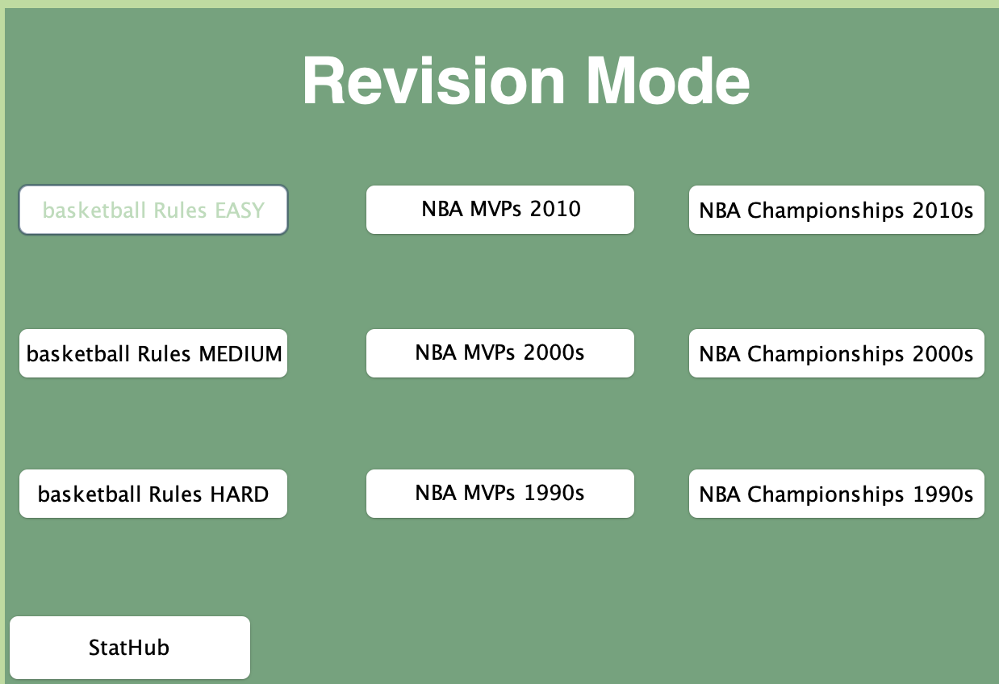

# StatPad

StatPad is an interactive quiz application that lets users test their knowledge about basketball. Users can take quizzes on topics like rules, players, history, and more. Each user's quiz performance is tracked, allowing them to review their stats and monitor their progress over time.

## Features
- Take quizzes on basketball rules, players, and history.
- Track quiz performance and store player stats.
- Review past quiz results to monitor improvement.
- Simple and interactive interface for engaging learning.

## How to Run
1. Clone the repository:
2. Navigate into the project directory:
3. Compile the Java program:
4. Run the program:

## Screenshots
Here is StatPad in action!!!
## Screenshots

Here’s StatPad in action:

